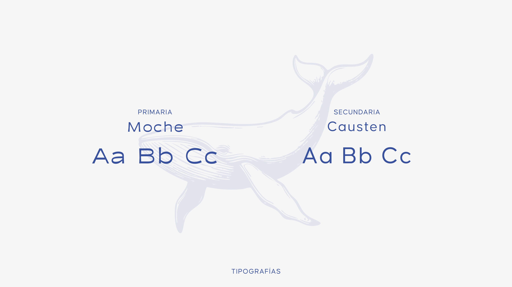
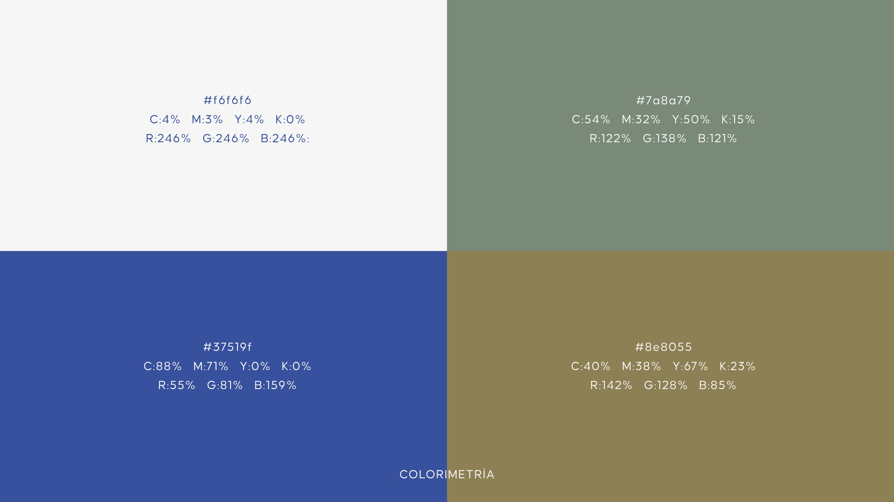
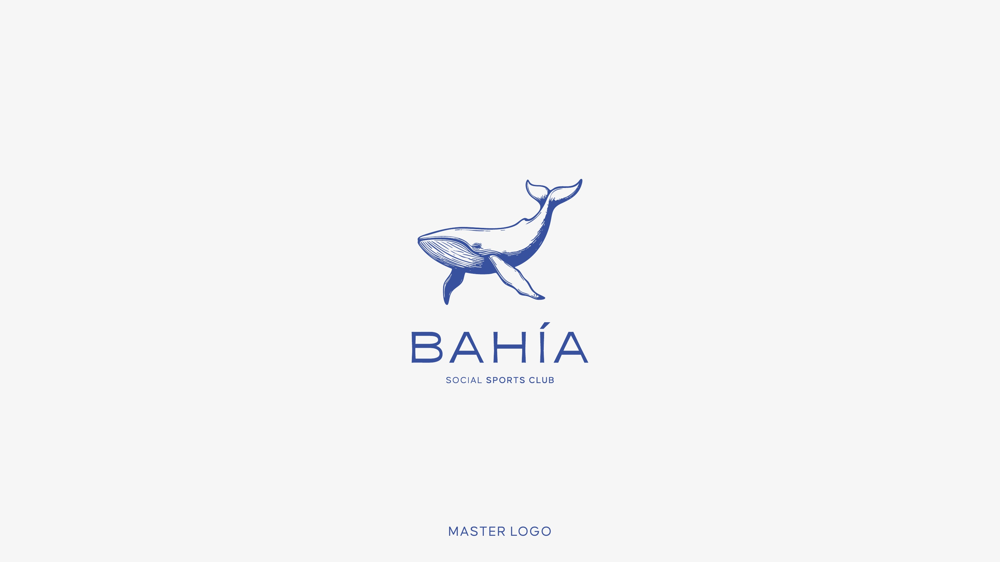
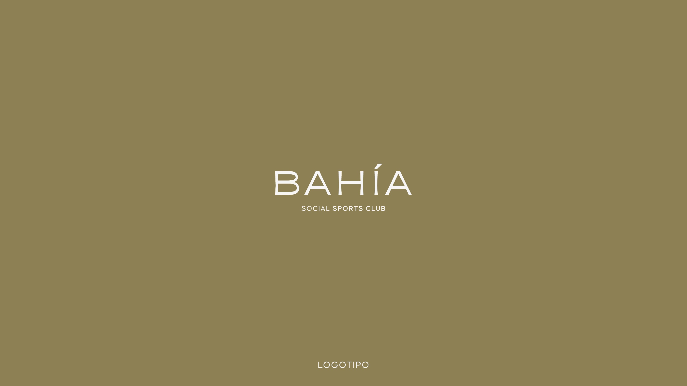
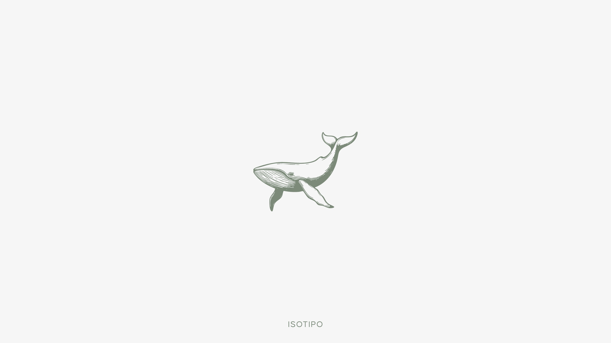
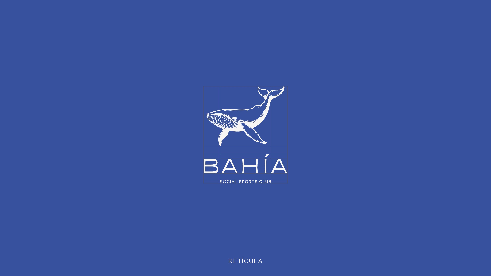
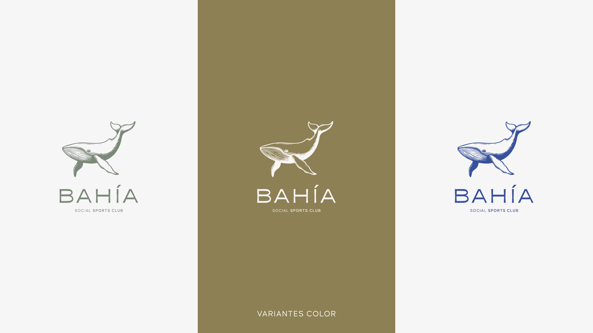

# BRIEFING — Rediseño bahiaclub.mx
**Cliente:** Bahia Social Sports Club  
**Sitio actual:** https://bahiaclub.mx/ (Squarespace, una sola página)  
**Objetivo:** Rediseñar y reconstruir el sitio en stack propio, con identidad visual oficial del brandbook, arquitectura de navegación expandida y contenido completo del club.

---

## 1. Identidad de Marca

### Golden Circle
| | |
|---|---|
| **WHAT** | Club deportivo que combina pádel, tenis y pickleball, además de gimnasio, áreas sociales y amenidades que enriquecen el estilo de vida de los miembros. |
| **HOW** | Instalaciones de vanguardia, atención impecable y atmósfera cercana y cálida, diseñada para brindar experiencias deportivas, sociales y de relajación que inspiran a la comunidad. |
| **WHY** | Creemos en ofrecer un espacio donde el deporte, la conexión y el bienestar trasciendan generaciones, fomentando una comunidad activa y sofisticada. |

### Keywords de Marca
`Comunidad · Cercanía · Estilo de vida · Bienestar · Naturaleza · Atemporal · Calidad · Deporte · Confianza · Sofisticación`

### Pilares de Marca
1. **Deporte y bienestar** — Canchas de pádel, tenis y pickleball, gimnasio, área fitness funcional y espacios de vapor para un estilo de vida activo y equilibrado.
2. **Experiencias Sociales y Familiares** — Restaurante, bar, palapas y áreas exclusivas para niños, en un entorno que combina lujo accesible con conexión auténtica con la naturaleza, incluyendo **ríos con cocodrilos, tortugas y garzas** en el predio.
3. **Flexibilidad y Comunidad** — Membresías temporales y permanentes para locales y visitantes internacionales.

### Arquetipos Jung
- **El Amante** — Prioriza la conexión, la estética y el disfrute de experiencias significativas en un entorno cercano y natural.
- **El Héroe** — Promueve el crecimiento personal y el logro de objetivos a través del deporte y el bienestar, empoderando a los miembros.

---

## 2. Sistema Visual

### Tipografía



| Rol | Fuente | Uso |
|---|---|---|
| **Primaria** | **Moche** | Títulos, logo "BAHÍA", encabezados de sección |
| **Secundaria** | **Causten** | Subtítulos, navegación, UI, "SOCIAL SPORTS CLUB" |

- "BAHÍA" siempre en mayúsculas, tracking amplio (`letter-spacing: 0.15–0.25em`)
- Ambas fuentes disponibles en Google Fonts

### Paleta de Colores Oficial



| Nombre | HEX | CMYK | RGB |
|---|---|---|---|
| Crema / Fondo | `#f6f6f6` | C:4% M:3% Y:4% K:0% | R:246 G:246 B:246 |
| Sage Verde | `#7a8a79` | C:54% M:32% Y:50% K:15% | R:122 G:138 B:121 |
| Azul (primario) | `#37519f` | C:88% M:71% Y:0% K:0% | R:55 G:81 B:159 |
| Oro / Oliva | `#8e8055` | C:40% M:38% Y:67% K:23% | R:142 G:128 B:85 |

> Usar estos valores exactos. El CSS del sitio actual tiene `#073E78` (azul más oscuro) — **no usar**, el oficial es `#37519f`.

### Logos y Variantes



**Master Logo** — Ballena ilustrada (estilo grabado/línea) + "BAHÍA" en Moche + "SOCIAL SPORTS CLUB" en Causten. Color azul `#37519f` sobre fondo crema. Esta es la versión principal.

---



**Logotipo** — Solo texto "BAHÍA / SOCIAL SPORTS CLUB" sin la ballena, en blanco sobre fondo dorado `#8e8055`. Para uso en fondos dorados o contextos donde el isotipo ya está presente.

---



**Isotipo** — Solo la ballena ilustrada, en sage `#7a8a79` sobre fondo crema. Para uso como ícono solo, favicons, elementos decorativos.

---



**Retícula** — Grid de construcción proporcional del logo. Blanco sobre fondo azul `#37519f`. Referencia para respetar proporciones al escalar.

---



**Variantes de Color** — Tres versiones autorizadas del logo completo (ballena + texto):
- **Sage** — Logo en `#7a8a79` sobre fondo crema (uso en fondos claros, tono suave)
- **Gold** — Logo en blanco sobre fondo dorado `#8e8055` (uso en secciones oscuras/doradas)
- **Blue** — Logo en `#37519f` sobre fondo crema (versión principal, uso frecuente)

**Archivo PNG del logo:** `./logos/bahia-logo2.png` (2500×2500px, fondo blanco)

---

## 3. Branding Sensorial

| Sentido | Descripción |
|---|---|
| **Vista** | Arquitectura moderna en armonía con la naturaleza; señalética clara; ríos con cocodrilos, tortugas y garzas como atractivo visual único del predio |
| **Oído** | Canchas: electrónica suave y house · Áreas sociales: jazz, bossa nova, indie acústico · Gimnasio/bienestar: chill-out, downtempo |
| **Tacto** | Materiales premium en canchas, equipos, muebles, palapas y bar. Confort y atención al detalle en cada superficie. |
| **Olfato** | Aroma exclusivo con notas de bambú, cítricos y madera. Difundido en gimnasio, vestidores y restaurante. |
| **Gusto** | Snacks saludables, platillos reconfortantes y cocteles originales en el bar. |

**Diferenciador único del predio:** El club tiene ríos naturales habitados por cocodrilos, tortugas y garzas. Esto es un asset narrativo que distingue a Bahia Club de cualquier otro club deportivo — debe integrarse en el storytelling del sitio.

---

## 4. Arquitectura de Navegación

```
[Logo]    Home    Instalaciones    Planes    Contacto    [CTA: "Agendar Visita"]
```

- Header con fondo translúcido (glassmorphism suave)
- Hamburger menu en móvil
- CTA "Agendar Visita" → Google Calendar: `calendar.app.google/cedvSmtcwGR3grVc6`
- Widget WhatsApp flotante (esquina inferior derecha)

---

## 5. Contenido por Sección

### Home

**Objetivo:** Primera impresión del club, comunicar el lifestyle y redirigir a las secciones principales.

**Hero:** Imagen de fondo de alta calidad del club + mensaje de bienvenida + CTA "Agendar Visita". Usar libremente cualquier foto de `./instalaciones/` — seleccionar la más impactante visualmente.

**Sección "¿Qué es Bahía?":** Texto basado en el Golden Circle (ver sección 1). Destacar el diferenciador de los ríos con vida silvestre.

**Servicios destacados:** 3 bloques visuales:
- Deporte (pádel / tenis / pickleball / gym)
- Experiencias Sociales (restaurante / bar / palapas / familia)
- Bienestar (vapor / alberca / vestidores premium)

**Galería mood:** Selección libre de fotos de `./instalaciones/` + `./instalaciones/inspo-moodboard.png` (imagen de referencia estética: sillas de director junto a cancha de césped, raquetas, limonadas, almohada con ballena — define el tono visual deseado: premium-relajado, lúdico).

**Bloque final:** CTA a contacto o WhatsApp.

---

### Instalaciones

**Objetivo:** Mostrar todas las áreas del club con foto y descripción para cada una.

Cada subsección incluye al menos una foto + texto descriptivo.

#### Pádel
- 8 canchas de pádel
- Foto: pendiente (no hay foto local disponible aún)

#### Tenis — Arcilla
- 3 canchas de tierra batida
- Foto: `./instalaciones/cancha-tenis-arcilla.jpg`
  - Cancha de arcilla naranja clásica, vegetación densa alrededor, cielo nublado. Aspecto natural y tradicional.

#### Tenis — Firme (Hard Court)
- 3 canchas de superficie dura
- Fotos: `./instalaciones/cancha-tenis-dura-01.png` · `./instalaciones/cancha-tenis-dura-02.png`
  - Canchas color **rosa/magenta** muy llamativas. Logo "Bahía" visible en las mamparas laterales. Palmeras al fondo. Elemento visual distintivo del club.

#### Pickleball
- 8 canchas de pickleball
- Fotos: `./instalaciones/pickleball-01.jpg` · `./instalaciones/pickleball-02.jpg` · `./instalaciones/pickleball-vista-aerea.png`
  - Superficie azul/roja. Vista aérea muestra la escala de las instalaciones. Foto lifestyle con paleta y bolas al atardecer.

#### Gimnasio
- Gimnasio completo
- Foto: `./instalaciones/gym.png`
  - Interior moderno, máquinas elípticas marca M, iluminación limpia.

#### Alberca
- Fotos: `./instalaciones/alberca-01.jpg` · `./instalaciones/alberca-02.png` · `./instalaciones/alberca-03.png` · `./instalaciones/alberca-y-restaurante.png`
  - Alberca familiar al atardecer con palmeras. Vista aérea con palapa. Edificio del restaurante visible al fondo en una de las tomas.

#### Áreas Verdes y Naturaleza
- Diferenciador único: ríos en el predio con cocodrilos, tortugas y garzas
- Fotos: `./instalaciones/vista-area-verde.jpg` · `./instalaciones/vista-desde-restaurante.jpg`

#### Restaurante y Bar
- Edificio de 2 pisos visible desde la alberca
- Foto de referencia: `./instalaciones/alberca-y-restaurante.png`

#### Vestidores
- Lockers de madera oscura premium + regaderas con acabados de mármol gris
- Fotos: `./instalaciones/lockers.png` · `./instalaciones/regaderas.png`

---

### Planes

**Objetivo:** Mostrar las opciones de membresía con claridad y CTA a contacto.

**Encabezado:** "MEMBRESÍAS" en Moche, estilo del brandbook.

**Referencia visual del brochure:** `./planes/membresias-2025.jpeg`

**Los 4 planes** (cada uno con un isotipo de ballena distinto):

| Plan | Incluye | Inscripción | Mensualidad |
|---|---|---|---|
| **Familiar** | 2 adultos + hasta 3 hijos menores de 28 años | $13,000 MXN | $6,500 MXN |
| **Pareja** | 2 adultos | $9,000 MXN | $4,500 MXN |
| **Individual** | 1 adulto | $5,000 MXN | $2,500 MXN |
| **Solo Gym*** | 1 adulto — acceso a gym, vestidores y alberca | $3,600 MXN | $1,800 MXN |

*Solo Gym no incluye acceso a áreas de raqueta (pádel, tenis, pickleball).

**CTA:** Botón "Contáctanos" → formulario o WhatsApp.

---

### Contacto

**Formulario de contacto:**
| Campo | Tipo |
|---|---|
| Nombre | Text |
| Apellido | Text |
| Email | Email |
| Teléfono | Tel |
| Membresía de interés | Checkboxes: Familiar / Pareja / Individual / Solo Gym |
| Mensaje | Textarea (opcional) |
| Novedades y actualizaciones | Checkbox opcional |

**Datos operacionales:**
| | |
|---|---|
| Email | membresias@bahiaclub.mx |
| Teléfono | +52 322 181 8382 |
| Dirección | Paseo de los Flamingos 38, Bahía de Banderas, Nay |
| Instagram | @bahiaclub.mx |
| Facebook | facebook.com/share/15B9L7CHpV/ |
| WhatsApp | wa.me/message/47BNUPNJYZDWL1 |
| Agendar Visita | calendar.app.google/cedvSmtcwGR3grVc6 |

---

## 6. Datos para Integraciones

| Servicio | Detalle |
|---|---|
| Google Calendar (agendar visitas) | `calendar.app.google/cedvSmtcwGR3grVc6` |
| WhatsApp (chat flotante) | `wa.me/message/47BNUPNJYZDWL1` |
| reCAPTCHA | Protección de formulario (invisible) |
| Selector de idioma | Español / Inglés (Weglot en el sitio actual) |

---

## 7. Instrucciones para Claude Code

### Stack
Decidir con el implementador. El sitio actual es Squarespace — se migra a stack propio.

### Assets disponibles
Todos los archivos están en la misma carpeta que este BRIEFING.md:

```
./logos/bahia-logo2.png              — Logo PNG oficial (2500×2500px)
./Brandbook.pdf                      — PDF completo del brandbook oficial
./brandbook-pages/13-master-logo.jpg — Logo principal (ballena + texto, azul)
./brandbook-pages/14-logotipo.jpg    — Solo texto, blanco sobre dorado
./brandbook-pages/15-isotipo.jpg     — Solo ballena, sage
./brandbook-pages/16-reticula.jpg    — Grid de construcción del logo
./brandbook-pages/17-variantes-color.jpg — 3 variantes de color del logo
./brandbook-pages/18-tipografias.jpg — Specimen Moche + Causten
./brandbook-pages/19-colorimetria.jpg — Paleta oficial con valores
./instalaciones/                     — Todas las fotos del club
./planes/membresias-2025.jpeg        — Brochure visual de membresías
```

Para el contexto completo de la marca, leer también las páginas del brandbook:
- `./brandbook-pages/01-portada.jpg` a `./brandbook-pages/11-branding-sensorial-tacto-olfato-gusto.jpg` — ADN de marca completo

### Reglas de identidad visual — NO modificar
- **Tipografías:** Moche (primaria) y Causten (secundaria). No sustituir por otras fuentes.
- **Paleta:** Usar exclusivamente los 4 colores del brandbook: `#f6f6f6` `#7a8a79` `#37519f` `#8e8055`
- **Logo:** Usar los archivos provistos. No recrear ni alterar proporciones.
- **Tono:** Premium-relajado, nunca ostentoso. El club es sofisticado pero cálido y cercano.

### Libertad creativa
- Layout, composición, animaciones y transiciones: **total libertad creativa**
- Selección de fotos por sección: el implementador elige las más efectivas
- Las fotos de `./instalaciones/inspo-moodboard.png` son referencia de tono visual — no obligatorias en ninguna sección específica
- Las imágenes del Home pueden reutilizarse en otras secciones o no — criterio del implementador
